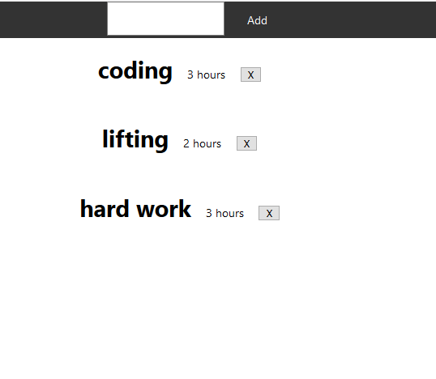
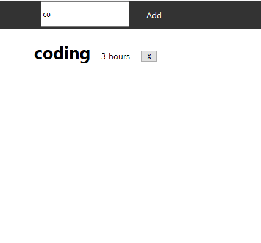
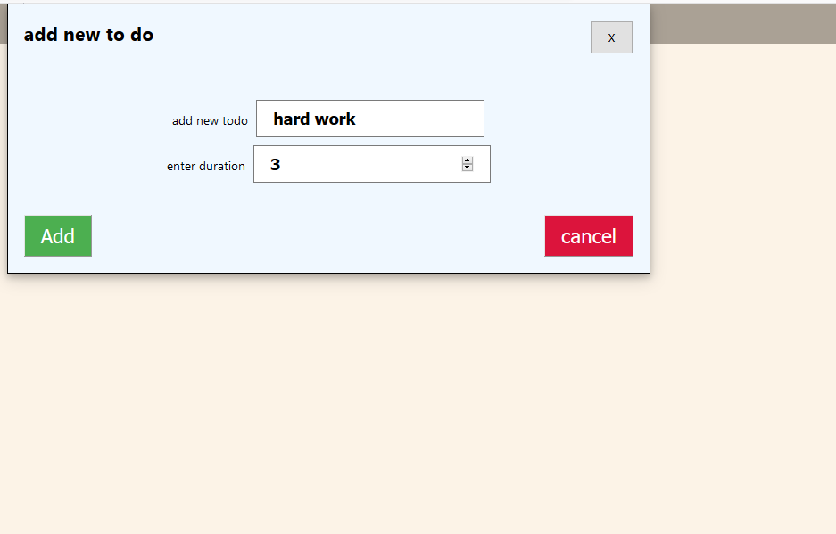
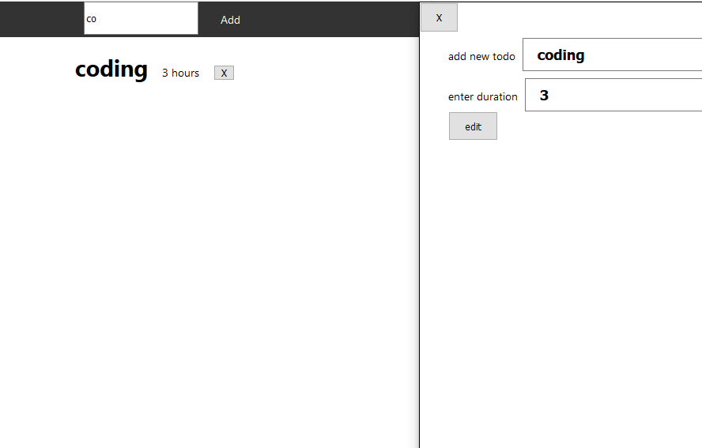

**hello  this is my first from scratch project** 

**every day a challenge is begin**
challenge 0

sorry if my english writing was bad 

i created it using react library , with some features thus i tried to invent 
some ideas will help improve this little app :)
some features i have created :
show todo list 
delete todo 
search todo
add to do
edit to do
soon be implemented :
 start chrono for each todo 
ui design 
create back end for save and control our data

  
  
   
   

 
html 
css
react 
redux 
axios
json server

you can contribute to this smart app , just pull a request :)

